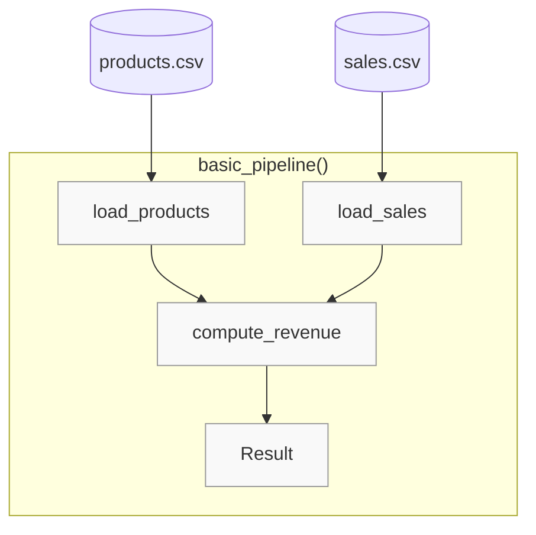

# 0.py - Plain Python Pipeline (No Prefect)

```mermaid
flowchart TD
    subgraph "basic_pipeline()"
        A[load_products] --> C[compute_revenue]
        B[load_sales] --> C
        C --> D[Result]
    end

    CSV1[(products.csv)] --> A
    CSV2[(sales.csv)] --> B

    style A fill:#f9f9f9,stroke:#999
    style B fill:#f9f9f9,stroke:#999
    style C fill:#f9f9f9,stroke:#999
    style D fill:#f9f9f9,stroke:#999
```

## Notes
- Plain Python functions (no decorators)
- No tracking, retries, caching, or UI visibility
- Sequential execution only
