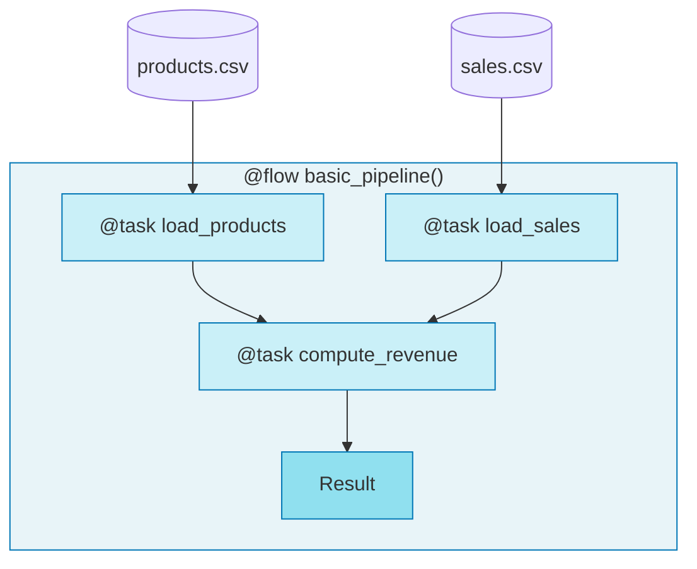

# 1.py - Basic Tasks and Flows

## Notes
- `@task` decorators enable tracking, retries, caching
- `@flow` orchestrates tasks and provides observability
- Prefect tracks: start time, duration, status, dependencies
