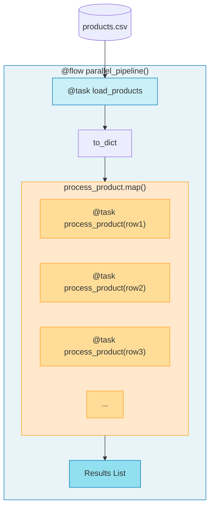

# 2.py - Parallel Execution with .map()

## Notes
- `.map()` applies a task to each item in a list
- Tasks run in parallel (concurrent execution)
- Results are collected in order
- Each mapped task is tracked independently in UI
