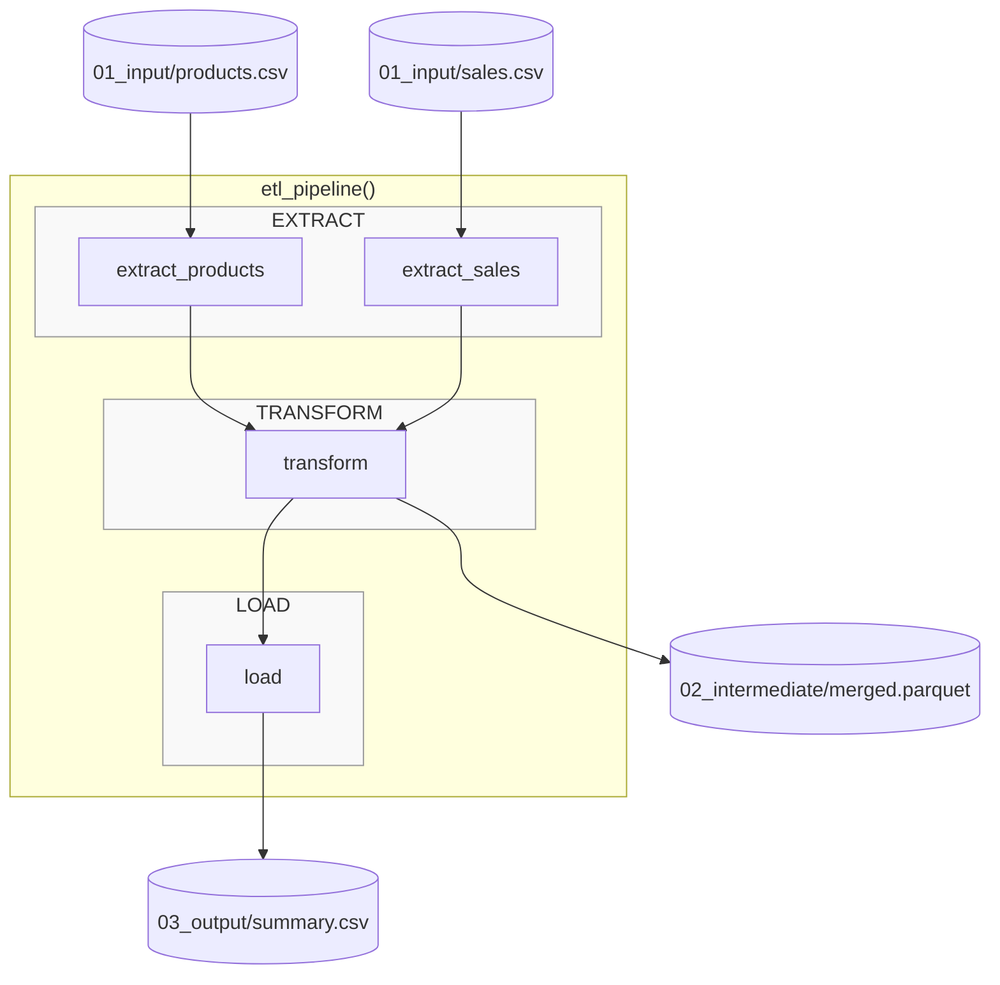

# 0.py - Plain Python ETL Pipeline (No Prefect)

## Notes
- Plain Python functions (no decorators)
- Files saved manually to data layers
- No execution tracking or UI visibility
- No artifact history or comparison
