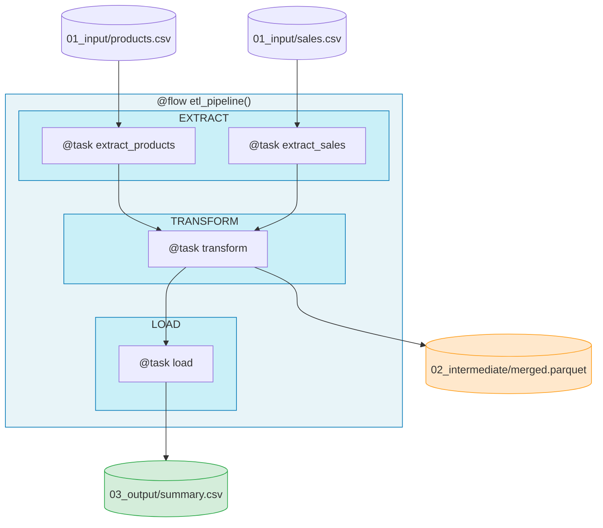

# 1.py - File-Based Artifacts (Data Layers)



## Data Layers (Kedro-inspired)
```
data/
├── 01_input/        # Raw source data (immutable)
├── 02_intermediate/ # Checkpoints (parquet)
└── 03_output/       # Final results
```

## Notes
- ETL pattern with Prefect tracking
- Parquet format for efficient intermediate storage
- File-based checkpoints enable recovery
