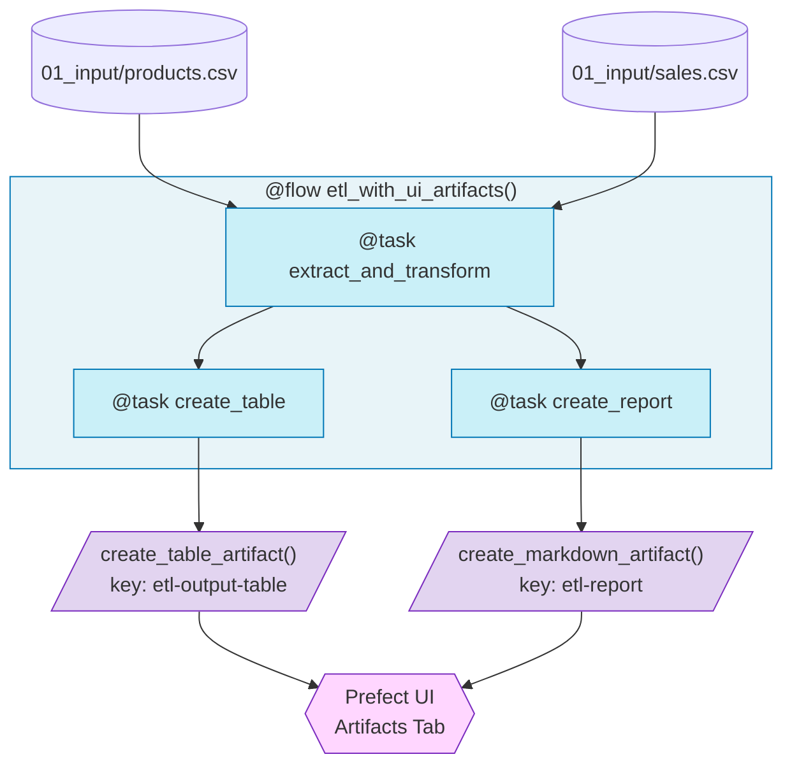

# 2.py - Prefect UI Artifacts

## Prefect Artifacts

| Type | Function | Use Case |
|------|----------|----------|
| Table | `create_table_artifact()` | DataFrames, metrics |
| Markdown | `create_markdown_artifact()` | Reports, summaries |

## Notes
- Artifacts visible in Prefect UI under "Artifacts" tab
- Persisted across runs for comparison
- Shareable with stakeholders via UI
