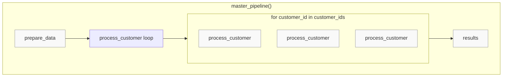

# 0.py - Plain Python Pipeline Composition (No Prefect)

## Notes
- Plain Python functions (no decorators)
- No visibility into execution hierarchy
- No tracking of individual function calls
- Manual orchestration
