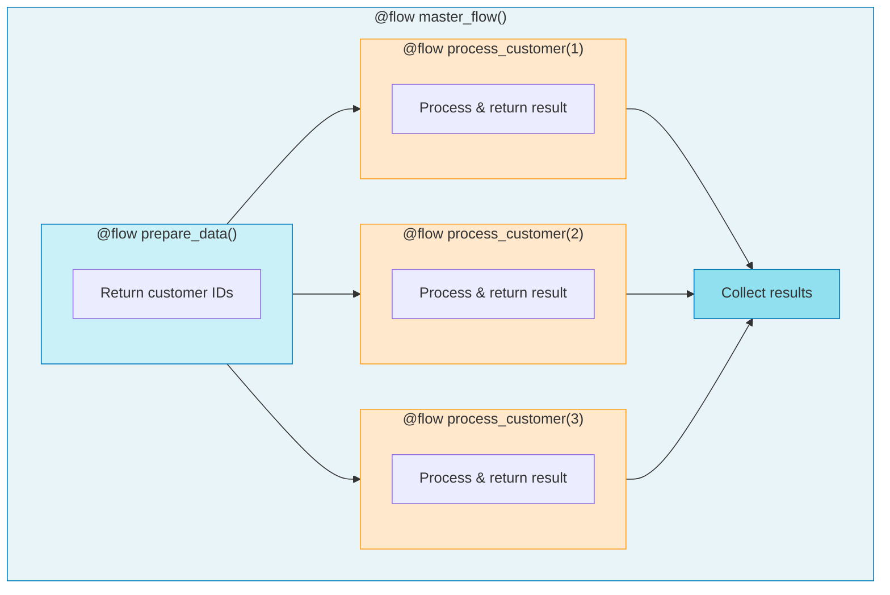

# 1.py - Basic Subflows



## Flow Hierarchy
```
master_flow (parent)
├── prepare_data (child)
└── process_customer (child, called 3x)
```

## Notes
- Flows can call other flows (subflows)
- Each subflow tracked independently in Prefect UI
- Parent-child relationships visible in UI
