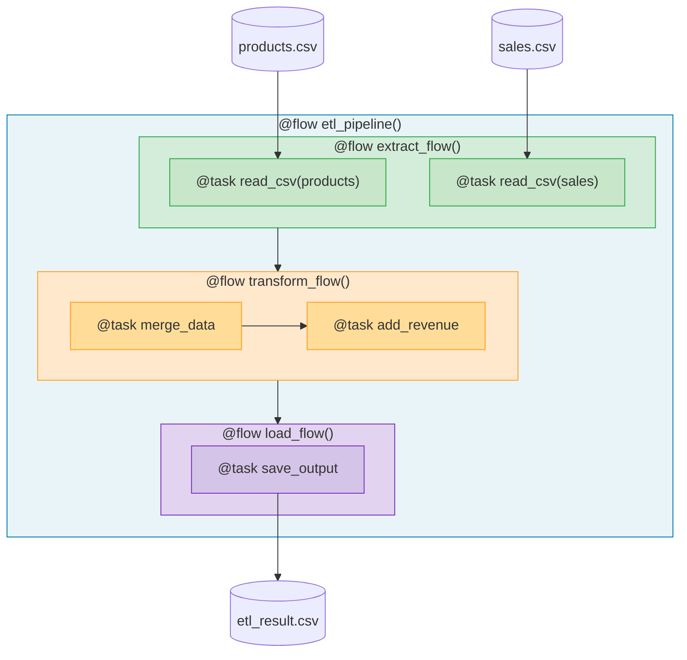

# 2.py - ETL Pattern with Subflows



## ETL Architecture
```
etl_pipeline (orchestrator)
├── extract_flow
│   ├── @task read_csv(products)
│   └── @task read_csv(sales)
├── transform_flow
│   ├── @task merge_data
│   └── @task add_revenue
└── load_flow
    └── @task save_output
```

## Notes
- Subflows group related tasks
- Each ETL phase is a reusable subflow
- Tasks within subflows for granular tracking
