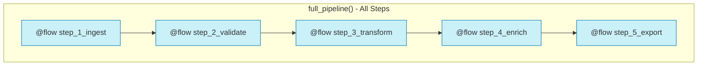
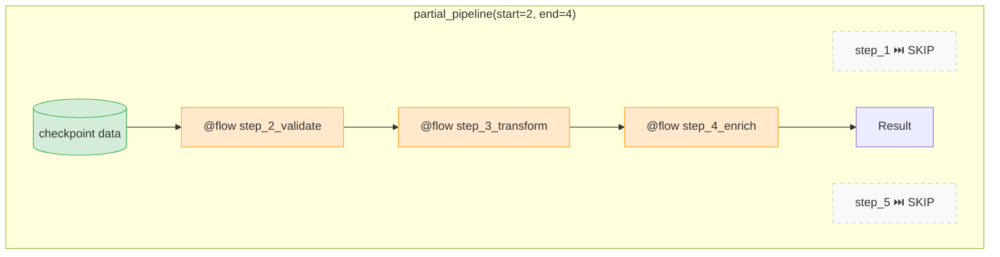

# 3.py - Partial Pipeline Execution





## Usage Examples

```python
# Run single step directly
step_3_transform({"raw": [10, 20]})

# Run steps 2-4 from checkpoint
partial_pipeline(start=2, end=4, initial_data=checkpoint)

# Run full pipeline
full_pipeline()
```

## Notes
- Each step is a subflow (can run independently)
- Resume from checkpoint with `initial_data`
- Useful for debugging, testing, and recovery
