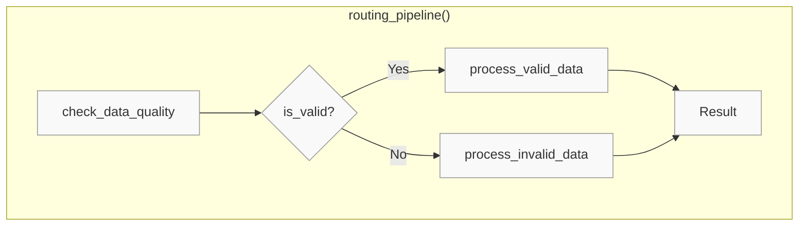

# 0.py - Plain Python Conditional Routing (No Prefect)

## Notes
- Plain Python functions (no decorators)
- No visibility into which branch was taken
- No tracking of routing decisions over time
- Manual logging required
