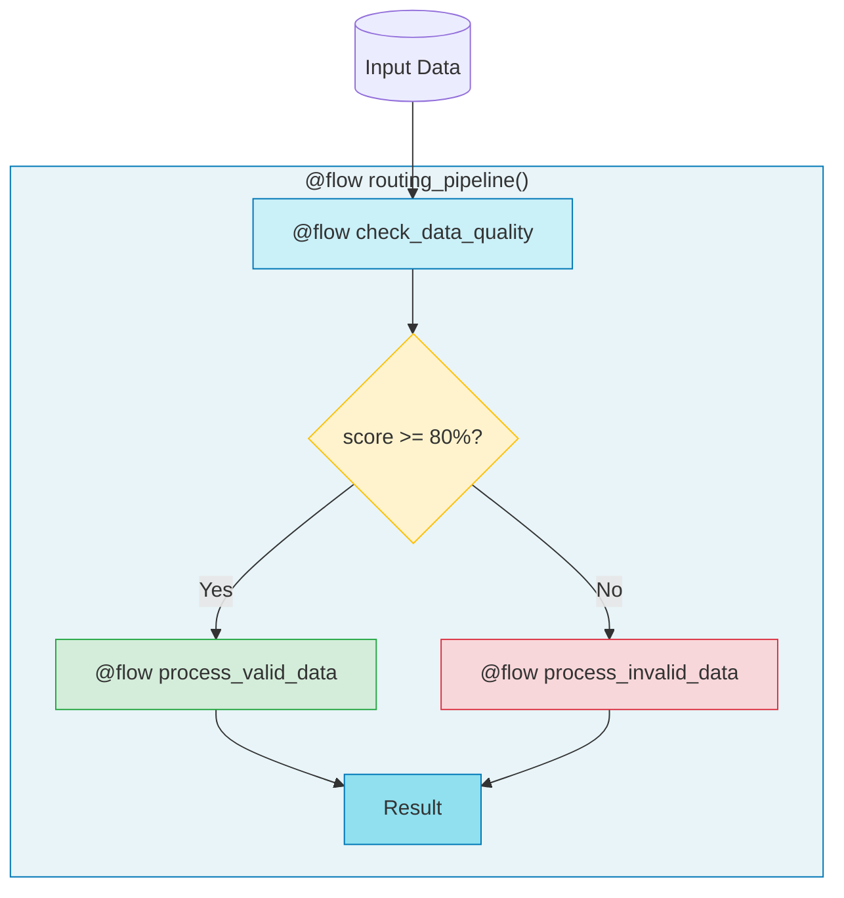

# 1.py - Basic If/Else Routing



## Routing Logic
```
if quality["is_valid"]:    # score >= 80%
    -> process_valid_data
else:
    -> process_invalid_data
```

## Notes
- Prefect tracks which branch was taken
- Each path visible in UI with execution details
- Routing history preserved across runs
