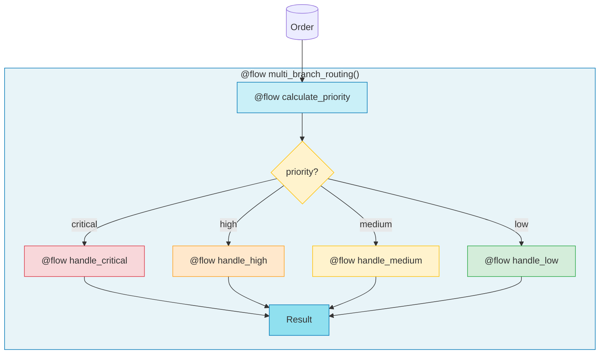

# 2.py - Multi-Branch Routing



## Priority Rules
| Priority | Condition |
|----------|-----------|
| Critical | value > $1000 AND urgent |
| High | value > $500 OR urgent |
| Medium | value > $100 |
| Low | otherwise |

## Dispatch Pattern
```python
handlers = {
    "critical": handle_critical,
    "high": handle_high,
    "medium": handle_medium,
    "low": handle_low,
}
result = handlers[priority](order)
```
