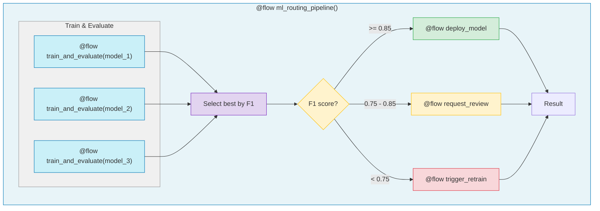

# 3.py - ML Threshold Routing



## ML Routing Thresholds
```
F1 >= 0.85       -> DEPLOY to production
0.75 <= F1 < 0.85 -> REQUEST human review
F1 < 0.75        -> TRIGGER retraining
```

## Pipeline Flow
1. Train multiple models
2. Evaluate each model (accuracy, F1)
3. Select best model by F1 score
4. Route based on threshold

## Notes
- Each routing decision tracked in Prefect UI
- Compare routing outcomes across pipeline runs
- Audit trail for model deployment decisions
