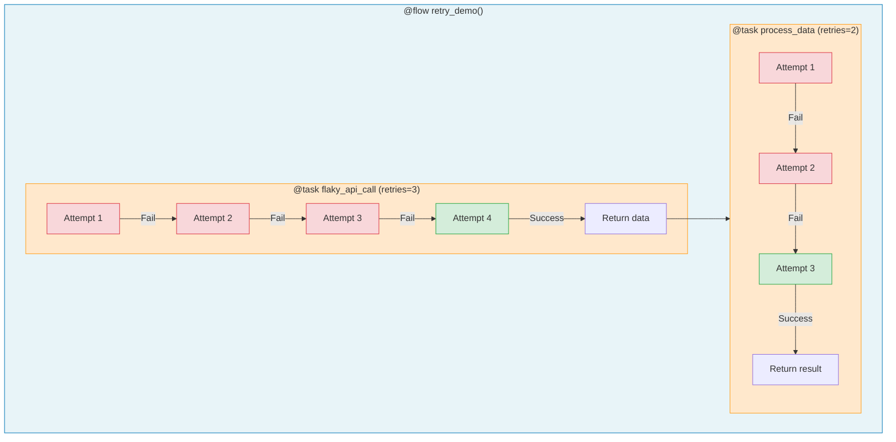

# 1.py - Basic Task Retries



## Retry Configuration
```python
@task(retries=3)  # 1 initial + 3 retries = 4 total attempts
def flaky_api_call(): ...

@task(retries=2)  # 1 initial + 2 retries = 3 total attempts
def process_data(): ...
```

## Notes
- Prefect automatically retries on any exception
- No try/except needed in flow code
- Each retry attempt tracked in UI
