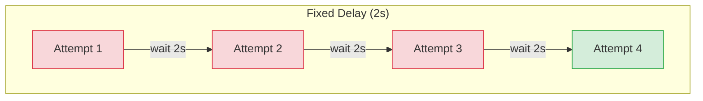
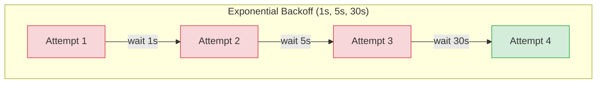

# 2.py - Exponential Backoff





## Delay Patterns

| Pattern | Config | Use Case |
|---------|--------|----------|
| Fixed | `retry_delay_seconds=2` | Simple retry |
| Exponential | `retry_delay_seconds=[1, 5, 30]` | Rate limits, backpressure |

## Configuration
```python
# Fixed delay
@task(retries=3, retry_delay_seconds=2)

# Exponential backoff
@task(retries=3, retry_delay_seconds=[1, 5, 30])
```

## Notes
- Exponential backoff ideal for API rate limits (429)
- Gives external services time to recover
- Prefect handles all timing automatically
