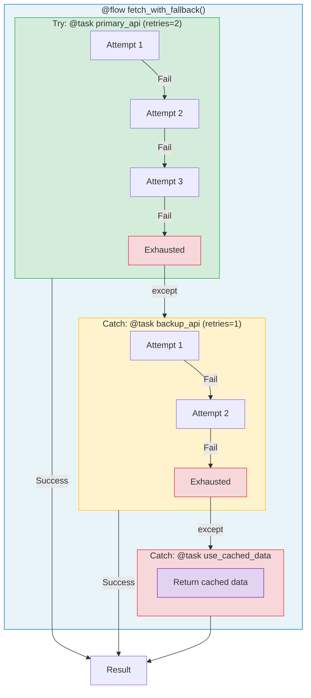

# 3.py - Fallback Patterns



## Cascading Fallback Pattern
```python
@flow
def fetch_with_fallback(endpoint):
    try:
        return primary_api(endpoint)    # Fast, unreliable
    except:
        pass

    try:
        return backup_api(endpoint)     # Slower, reliable
    except:
        pass

    return use_cached_data()            # Last resort
```

## Fallback Hierarchy
| Priority | Source | Reliability | Speed |
|----------|--------|-------------|-------|
| 1 | Primary API | Low (80% fail) | Fast |
| 2 | Backup API | High (20% fail) | Medium |
| 3 | Cached Data | 100% | Instant |

## Notes
- Each level has its own retry configuration
- Graceful degradation when all APIs fail
- Prefect tracks which fallback was used
