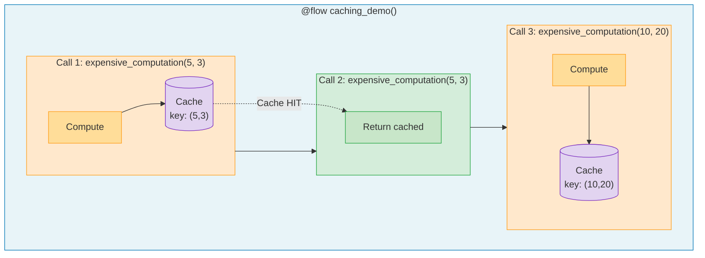

# 1.py - Basic Task Caching



## Cache Behavior
| Call | Inputs | Action | Time |
|------|--------|--------|------|
| 1 | (5, 3) | Compute | 2s |
| 2 | (5, 3) | Cache hit | ~0s |
| 3 | (10, 20) | Compute (new key) | 2s |

## Configuration
```python
from prefect.cache_policies import INPUTS

@task(cache_policy=INPUTS)
def expensive_computation(x, y):
    # Cached by input values
    return x + y
```

## Notes
- `INPUTS` policy caches by function arguments
- Same inputs = cache hit (instant return)
- Different inputs = new computation
