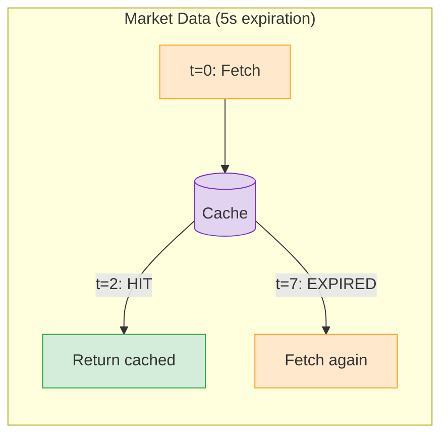
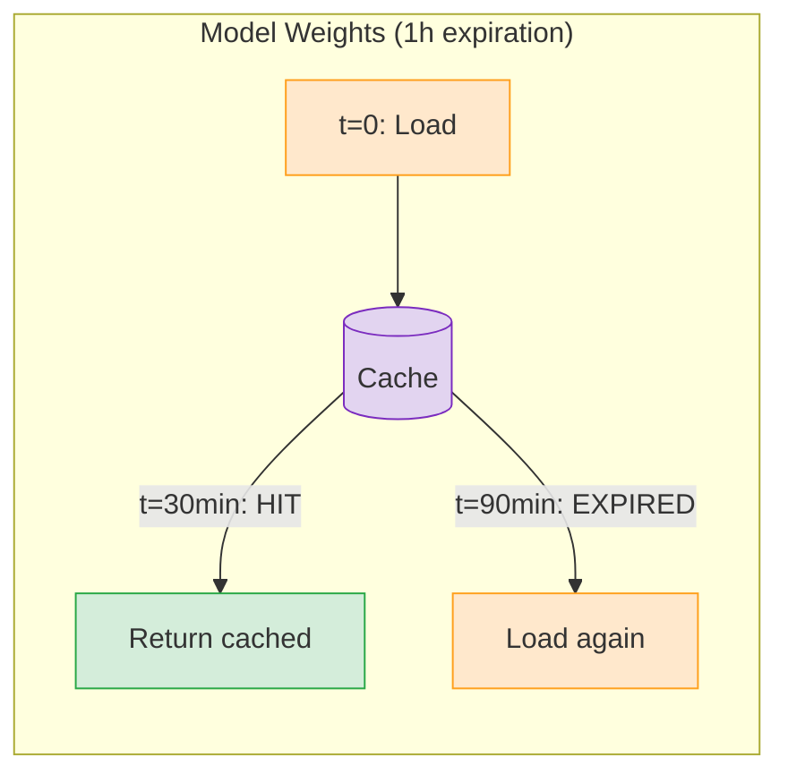

# 2.py - Cache Expiration





## Expiration Strategies
| Data Type | Expiration | Reason |
|-----------|------------|--------|
| Market data | 5 seconds | Changes frequently |
| Model weights | 1 hour | Changes rarely |
| API responses | minutes | Balance freshness/cost |
| Static config | hours/days | Almost never changes |

## Configuration
```python
from datetime import timedelta

@task(
    cache_policy=INPUTS,
    cache_expiration=timedelta(seconds=5)
)
def fetch_market_data(symbol): ...

@task(
    cache_policy=INPUTS,
    cache_expiration=timedelta(hours=1)
)
def load_model_weights(model_name): ...
```

## Notes
- Expired cache = automatic recomputation
- No manual invalidation needed
- Choose expiration based on data volatility
