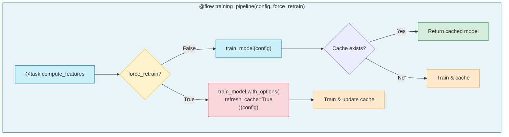
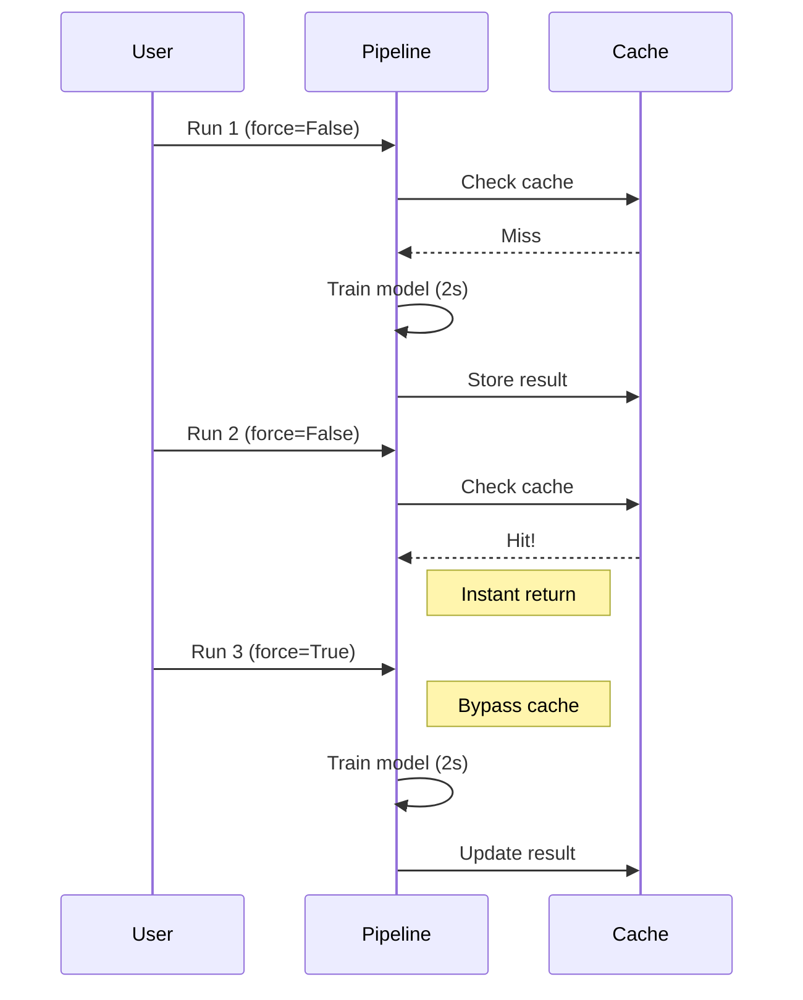

# 3.py - Cache Refresh Pattern



## Execution Timeline


## Force Refresh Pattern
```python
# Normal call - uses cache if available
model = train_model(config)

# Force refresh - bypasses cache
model = train_model.with_options(refresh_cache=True)(config)
```

## Use Cases
- **Retraining**: Force new model with same config
- **Data refresh**: Get fresh data despite valid cache
- **Debugging**: Bypass cache to test changes
- **Scheduled updates**: Periodic cache refresh
